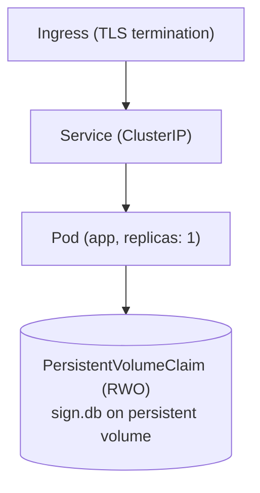

import { Accordion, Accordions } from 'fumadocs-ui/components/accordion';
import { Callout } from 'fumadocs-ui/components/callout';

## Prerequisites

Before starting, ensure you have:

- A Kubernetes cluster (1.24+) running and accessible
- `kubectl` configured to communicate with your cluster
- A `ReadWriteOnce` PersistentVolumeClaim for the SQLite database (mounted at `BASE_PATH`)
- SMTP credentials for sending emails
- A domain name with DNS configured
- An Ingress controller installed (nginx-ingress, traefik, etc.)

Verify your cluster connection:

```bash
kubectl cluster-info
kubectl get nodes
```

## Architecture Overview

esign uses an embedded SQLite database (Hanzo Base) — a single shared `sign.db`
file with tenancy enforced at the query layer (see HIP-0305), not an external
database server. The database lives on a `ReadWriteOnce` PersistentVolumeClaim
owned by a single app Pod. A typical deployment consists of:



<Callout type="warn">
  SQLite is a **single-writer** database. The app Deployment must run a single
  replica that owns the `ReadWriteOnce` volume. Do not scale the web tier to
  multiple replicas or attach an HPA to it — concurrent writers to the same
  `sign.db` produce `SQLITE_BUSY` and risk corruption. Scale vertically (more CPU
  and memory) instead, and offload documents to S3 to keep the database small.
</Callout>

## Namespace Setup

Create a dedicated namespace for Hanzo Sign:

```yaml
# namespace.yaml
apiVersion: v1
kind: Namespace
metadata:
  name: hanzo-sign
  labels:
    app.kubernetes.io/name: hanzo-sign
```

Apply the namespace:

```bash
kubectl apply -f namespace.yaml
```

## Secrets Configuration

Store sensitive configuration in Kubernetes Secrets.

### Generate Secrets

First, generate the required secret values:

```bash
# Generate NEXT_PRIVATE_AUTH_SECRET
openssl rand -base64 32

# Generate encryption keys (minimum 32 characters each)
openssl rand -base64 32
openssl rand -base64 32
```

### Create the Secret

```yaml
# secret.yaml
apiVersion: v1
kind: Secret
metadata:
  name: hanzo-sign-secrets
  namespace: hanzo-sign
  labels:
    app.kubernetes.io/name: hanzo-sign
type: Opaque
stringData:
  NEXT_PRIVATE_AUTH_SECRET: 'your-generated-secret-here'
  NEXT_PRIVATE_ENCRYPTION_KEY: 'your-encryption-key-min-32-chars'
  NEXT_PRIVATE_ENCRYPTION_SECONDARY_KEY: 'your-secondary-key-min-32-chars'
  NEXT_PRIVATE_SMTP_USERNAME: 'your-smtp-username'
  NEXT_PRIVATE_SMTP_PASSWORD: 'your-smtp-password'
  NEXT_PRIVATE_SIGNING_PASSPHRASE: 'your-certificate-passphrase'
```

The SQLite `DATABASE_URL` and `BASE_PATH` are not secrets — they are file paths,
not credentials — so they live in the ConfigMap below.

<Callout type="warn">
  Never commit Secret manifests with real values to version control. Use a secrets management tool
  like Sealed Secrets, External Secrets Operator, or your cloud provider's secret manager.
</Callout>

Apply the secret:

```bash
kubectl apply -f secret.yaml
```

## ConfigMap

Store non-sensitive configuration in a ConfigMap:

```yaml
# configmap.yaml
apiVersion: v1
kind: ConfigMap
metadata:
  name: hanzo-sign-config
  namespace: hanzo-sign
  labels:
    app.kubernetes.io/name: hanzo-sign
data:
  NEXT_PUBLIC_WEBAPP_URL: 'https://sign.example.com'
  NEXT_PRIVATE_SMTP_TRANSPORT: 'smtp-auth'
  NEXT_PRIVATE_SMTP_HOST: 'smtp.example.com'
  NEXT_PRIVATE_SMTP_PORT: '587'
  NEXT_PRIVATE_SMTP_FROM_NAME: 'Hanzo Sign'
  NEXT_PRIVATE_SMTP_FROM_ADDRESS: 'noreply@example.com'
  NEXT_PRIVATE_INTERNAL_WEBAPP_URL: 'http://localhost:3000'
  NEXT_PRIVATE_SIGNING_LOCAL_FILE_PATH: '/opt/hanzo-sign/cert.p12'
  NEXT_PUBLIC_UPLOAD_TRANSPORT: 'database'
  BASE_PATH: '/opt/hanzo-sign/base/data'
  DATABASE_URL: 'file:/opt/hanzo-sign/base/data/_dev/sign.db'
```

Apply the ConfigMap:

```bash
kubectl apply -f configmap.yaml
```

## Persistent Volume

The SQLite database lives on a `ReadWriteOnce` PersistentVolumeClaim mounted at
`BASE_PATH`. Create it before the Deployment so the claim exists when the Pod
starts:

```yaml
# pvc.yaml
apiVersion: v1
kind: PersistentVolumeClaim
metadata:
  name: hanzo-sign-data
  namespace: hanzo-sign
  labels:
    app.kubernetes.io/name: hanzo-sign
spec:
  accessModes:
    - ReadWriteOnce
  resources:
    requests:
      storage: 20Gi
```

Apply the PVC:

```bash
kubectl apply -f pvc.yaml
```

<Callout type="warn">
  Size the volume for your document corpus if you use database storage — the
  PDFs live in the same `sign.db` file. Offload to S3 to keep the volume small.
  Because the claim is `ReadWriteOnce`, it can only be mounted by the single app
  Pod; this is what enforces the one-writer rule.
</Callout>

## Deployment

Create the Hanzo Sign Deployment:

```yaml
# deployment.yaml
apiVersion: apps/v1
kind: Deployment
metadata:
  name: hanzo-sign
  namespace: hanzo-sign
  labels:
    app.kubernetes.io/name: hanzo-sign
    app.kubernetes.io/component: web
spec:
  # SQLite is single-writer: exactly one Pod owns the RWO volume.
  replicas: 1
  selector:
    matchLabels:
      app.kubernetes.io/name: hanzo-sign
      app.kubernetes.io/component: web
  strategy:
    # Recreate (not RollingUpdate): the old Pod must release the RWO volume
    # before the new Pod can mount it. A rolling surge would deadlock.
    type: Recreate
  template:
    metadata:
      labels:
        app.kubernetes.io/name: hanzo-sign
        app.kubernetes.io/component: web
    spec:
      securityContext:
        runAsUser: 1001
        runAsGroup: 1001
        fsGroup: 1001
      containers:
        - name: hanzo-sign
          image: hanzo-sign/hanzo-sign:latest
          imagePullPolicy: Always
          ports:
            - name: http
              containerPort: 3000
              protocol: TCP
          envFrom:
            - configMapRef:
                name: hanzo-sign-config
            - secretRef:
                name: hanzo-sign-secrets
          resources:
            requests:
              cpu: 250m
              memory: 512Mi
            limits:
              cpu: 1000m
              memory: 1Gi
          livenessProbe:
            httpGet:
              path: /api/health
              port: http
            initialDelaySeconds: 30
            periodSeconds: 10
            timeoutSeconds: 5
            failureThreshold: 3
          readinessProbe:
            httpGet:
              path: /api/health
              port: http
            initialDelaySeconds: 10
            periodSeconds: 5
            timeoutSeconds: 3
            failureThreshold: 3
          startupProbe:
            httpGet:
              path: /api/health
              port: http
            initialDelaySeconds: 10
            periodSeconds: 5
            timeoutSeconds: 3
            failureThreshold: 30
          volumeMounts:
            - name: base-data
              mountPath: /opt/hanzo-sign/base/data
            - name: signing-cert
              mountPath: /opt/hanzo-sign/cert.p12
              subPath: cert.p12
              readOnly: true
      volumes:
        - name: base-data
          persistentVolumeClaim:
            claimName: hanzo-sign-data
        - name: signing-cert
          secret:
            secretName: hanzo-sign-signing-cert
            items:
              - key: cert.p12
                path: cert.p12
```

<Callout type="info">
  Pin to a specific image tag (e.g., `hanzo-sign/hanzo-sign:1.5.0`) in production instead of `latest`
  to ensure predictable deployments.
</Callout>

### Signing Certificate Secret

Create a secret for the signing certificate:

```bash
kubectl create secret generic hanzo-sign-signing-cert \
  --namespace hanzo-sign \
  --from-file=cert.p12=/path/to/your/cert.p12
```

Apply the deployment:

```bash
kubectl apply -f deployment.yaml
```

## Service

Expose the Deployment with a Service:

```yaml
# service.yaml
apiVersion: v1
kind: Service
metadata:
  name: hanzo-sign
  namespace: hanzo-sign
  labels:
    app.kubernetes.io/name: hanzo-sign
    app.kubernetes.io/component: web
spec:
  type: ClusterIP
  ports:
    - name: http
      port: 80
      targetPort: http
      protocol: TCP
  selector:
    app.kubernetes.io/name: hanzo-sign
    app.kubernetes.io/component: web
```

Apply the service:

```bash
kubectl apply -f service.yaml
```

## Ingress Configuration

### nginx-ingress

```yaml
# ingress-nginx.yaml
apiVersion: networking.k8s.io/v1
kind: Ingress
metadata:
  name: hanzo-sign
  namespace: hanzo-sign
  labels:
    app.kubernetes.io/name: hanzo-sign
  annotations:
    nginx.ingress.kubernetes.io/proxy-body-size: '50m'
    nginx.ingress.kubernetes.io/proxy-read-timeout: '300'
    nginx.ingress.kubernetes.io/proxy-send-timeout: '300'
    cert-manager.io/cluster-issuer: 'letsencrypt-prod'
spec:
  ingressClassName: nginx
  tls:
    - hosts:
        - sign.example.com
      secretName: hanzo-sign-tls
  rules:
    - host: sign.example.com
      http:
        paths:
          - path: /
            pathType: Prefix
            backend:
              service:
                name: hanzo-sign
                port:
                  name: http
```

### Traefik

```yaml
# ingress-traefik.yaml
apiVersion: networking.k8s.io/v1
kind: Ingress
metadata:
  name: hanzo-sign
  namespace: hanzo-sign
  labels:
    app.kubernetes.io/name: hanzo-sign
  annotations:
    traefik.ingress.kubernetes.io/router.entrypoints: websecure
    traefik.ingress.kubernetes.io/router.tls: 'true'
    cert-manager.io/cluster-issuer: 'letsencrypt-prod'
spec:
  ingressClassName: traefik
  tls:
    - hosts:
        - sign.example.com
      secretName: hanzo-sign-tls
  rules:
    - host: sign.example.com
      http:
        paths:
          - path: /
            pathType: Prefix
            backend:
              service:
                name: hanzo-sign
                port:
                  name: http
```

Apply your chosen ingress:

```bash
kubectl apply -f ingress-nginx.yaml
# or
kubectl apply -f ingress-traefik.yaml
```

## Database

There is no database tier to deploy. esign's database is the embedded SQLite
`sign.db` file on the [Persistent Volume](#persistent-volume) created above — no
managed PostgreSQL service (RDS, Cloud SQL, Azure Database) to attach and no
in-cluster database StatefulSet to operate.

Durability is a property of the volume: use a StorageClass backed by reliable,
snapshot-capable block storage, and schedule volume snapshots. See
[Backups](/docs/self-hosting/maintenance/backups).

<Callout type="info">
  For strict ordering guarantees you may model the app as a single-replica
  StatefulSet with a `volumeClaimTemplate` instead of a Deployment + standalone
  PVC. Either way the invariant is the same: one Pod, one `ReadWriteOnce` volume,
  one writer.
</Callout>

## Persistent Storage (Documents)

Hanzo Sign stores documents in the database by default. For high-volume deployments, configure S3-compatible storage.

### S3 Configuration

Add these to your ConfigMap and Secret:

```yaml
# In configmap.yaml, add:
data:
  NEXT_PUBLIC_UPLOAD_TRANSPORT: 's3'

# In secret.yaml, add:
stringData:
  NEXT_PRIVATE_UPLOAD_ENDPOINT: 'https://s3.amazonaws.com'
  NEXT_PRIVATE_UPLOAD_REGION: 'us-east-1'
  NEXT_PRIVATE_UPLOAD_BUCKET: 'your-hanzo-sign-bucket'
  NEXT_PRIVATE_UPLOAD_ACCESS_KEY_ID: 'your-access-key'
  NEXT_PRIVATE_UPLOAD_SECRET_ACCESS_KEY: 'your-secret-key'
```

See [Storage Configuration](/docs/self-hosting/configuration/storage) for detailed S3 setup instructions.

## Scaling

<Callout type="warn">
  Do **not** add a HorizontalPodAutoscaler or raise `replicas` above 1 for the web
  tier. esign's SQLite database is single-writer and the `ReadWriteOnce` volume
  can only be mounted by one Pod. Scale vertically instead.
</Callout>

### Vertical Scaling

Give the single Pod more CPU and memory by raising its resource requests and
limits in the Deployment:

```yaml
resources:
  requests:
    cpu: 500m
    memory: 1Gi
  limits:
    cpu: '2'
    memory: 2Gi
```

Apply the change:

```bash
kubectl apply -f deployment.yaml
```

### Reducing Database Pressure

The most effective way to keep a single replica fast is to keep the `sign.db`
file small:

- Set `NEXT_PUBLIC_UPLOAD_TRANSPORT=s3` so document PDFs live in object storage
  rather than the database file. See [Storage Configuration](/docs/self-hosting/configuration/storage).
- Archive old audit logs and completed documents on a schedule.

<Callout type="info">
  A PodDisruptionBudget is intentionally omitted. With a single replica owning a
  `ReadWriteOnce` volume, a `minAvailable: 1` PDB would block voluntary node
  drains entirely. Rely on the `Recreate` strategy: the Pod is rescheduled onto a
  new node and re-mounts the volume there.
</Callout>

## Troubleshooting

<Accordions type="multiple">
  <Accordion title="Pods not starting">
    Check pod status: 
    
    ```bash
    # Get pod status
    kubectl get pods -n hanzo-sign
    
    # Describe pod
    kubectl describe pod <pod-name> -n hanzo-sign
    ```
    
    Common causes: 
    - ImagePullBackOff (check image name and registry access)
    - CrashLoopBackOff (check logs for application errors)
    - Pending (check resource requests and node capacity)
  </Accordion>
  <Accordion title="unable to open database file / database is locked">
    The SQLite database is the file at `DATABASE_URL` on the mounted PVC. Confirm
    the volume is mounted and the file exists, then probe it from inside the Pod:

    ```bash
    kubectl exec -it deploy/hanzo-sign -n hanzo-sign -- ls -la /opt/hanzo-sign/base/data/_dev
    kubectl exec -it deploy/hanzo-sign -n hanzo-sign -- sqlite3 /opt/hanzo-sign/base/data/_dev/sign.db 'SELECT 1'
    ```

    Persistent `database is locked` errors almost always mean more than one Pod is
    writing the same file — verify `replicas: 1` and that no second Deployment or
    Job mounts the same PVC.
  </Accordion>
  <Accordion title="Ingress not working">
    Check Ingress status:
    
    ```bash
    # Get Ingress status
    kubectl get ingress -n hanzo-sign
    
    # Describe Ingress
    kubectl describe ingress hanzo-sign -n hanzo-sign
    ```
    
    Verify the Ingress controller is running:
    
    ```bash
    # Get Ingress controller status
    kubectl get pods -n ingress-nginx
    
    # Get Traefik controller status
    kubectl get pods -n traefik
    ```
  </Accordion>
  <Accordion title="Certificate errors">
    Check the signing certificate secret: 
    
    ```bash
    # Get signing certificate secret
    kubectl get secret hanzo-sign-signing-cert -n hanzo-sign -o yaml
    ```
    
    Verify the certificate is mounted correctly:
    
    ```bash
    # Execute command in pod
    kubectl exec -it <pod-name> -n hanzo-sign -- ls -la /opt/hanzo-sign/
    ```
  </Accordion>
  <Accordion title="Health check failures">
    Test the health endpoint: 
    
    ```bash
    # Port forward
    kubectl port-forward svc/hanzo-sign 3000:80 -n hanzo-sign
    
    # Test health endpoint
    curl http://localhost:3000/api/health
    ```
  </Accordion>
  <Accordion title="Rolling back a deployment">
    If a deployment fails, rollback: 
    ```bash
    # View history
    kubectl rollout history deployment/hanzo-sign -n hanzo-sign

    # Rollback to previous version
    kubectl rollout undo deployment/hanzo-sign -n hanzo-sign

    # Rollback to a specific revision
    kubectl rollout undo deployment/hanzo-sign -n hanzo-sign --to-revision=2
    ```

  </Accordion>
</Accordions>

## Complete Example

Here's a combined manifest for reference:

```yaml
# hanzo-sign-complete.yaml
---
apiVersion: v1
kind: Namespace
metadata:
  name: hanzo-sign
  labels:
    app.kubernetes.io/name: hanzo-sign
---
apiVersion: v1
kind: ConfigMap
metadata:
  name: hanzo-sign-config
  namespace: hanzo-sign
data:
  NEXT_PUBLIC_WEBAPP_URL: 'https://sign.example.com'
  NEXT_PRIVATE_SMTP_TRANSPORT: 'smtp-auth'
  NEXT_PRIVATE_SMTP_HOST: 'smtp.example.com'
  NEXT_PRIVATE_SMTP_PORT: '587'
  NEXT_PRIVATE_SMTP_FROM_NAME: 'Hanzo Sign'
  NEXT_PRIVATE_SMTP_FROM_ADDRESS: 'noreply@example.com'
  NEXT_PRIVATE_INTERNAL_WEBAPP_URL: 'http://localhost:3000'
  NEXT_PRIVATE_SIGNING_LOCAL_FILE_PATH: '/opt/hanzo-sign/cert.p12'
  NEXT_PUBLIC_UPLOAD_TRANSPORT: 'database'
  BASE_PATH: '/opt/hanzo-sign/base/data'
  DATABASE_URL: 'file:/opt/hanzo-sign/base/data/_dev/sign.db'
---
apiVersion: v1
kind: Secret
metadata:
  name: hanzo-sign-secrets
  namespace: hanzo-sign
type: Opaque
stringData:
  NEXT_PRIVATE_AUTH_SECRET: 'REPLACE_WITH_GENERATED_SECRET'
  NEXT_PRIVATE_ENCRYPTION_KEY: 'REPLACE_WITH_32_CHAR_KEY'
  NEXT_PRIVATE_ENCRYPTION_SECONDARY_KEY: 'REPLACE_WITH_32_CHAR_KEY'
  NEXT_PRIVATE_SMTP_USERNAME: 'smtp-user'
  NEXT_PRIVATE_SMTP_PASSWORD: 'smtp-password'
  NEXT_PRIVATE_SIGNING_PASSPHRASE: 'cert-passphrase'
---
apiVersion: v1
kind: PersistentVolumeClaim
metadata:
  name: hanzo-sign-data
  namespace: hanzo-sign
spec:
  accessModes:
    - ReadWriteOnce
  resources:
    requests:
      storage: 20Gi
---
apiVersion: apps/v1
kind: Deployment
metadata:
  name: hanzo-sign
  namespace: hanzo-sign
spec:
  # SQLite is single-writer: one Pod owns the RWO volume.
  replicas: 1
  strategy:
    type: Recreate
  selector:
    matchLabels:
      app.kubernetes.io/name: hanzo-sign
  template:
    metadata:
      labels:
        app.kubernetes.io/name: hanzo-sign
    spec:
      securityContext:
        runAsUser: 1001
        runAsGroup: 1001
        fsGroup: 1001
      containers:
        - name: hanzo-sign
          image: hanzo-sign/hanzo-sign:latest
          ports:
            - name: http
              containerPort: 3000
          envFrom:
            - configMapRef:
                name: hanzo-sign-config
            - secretRef:
                name: hanzo-sign-secrets
          resources:
            requests:
              cpu: 250m
              memory: 512Mi
            limits:
              cpu: 1000m
              memory: 1Gi
          livenessProbe:
            httpGet:
              path: /api/health
              port: http
            initialDelaySeconds: 30
            periodSeconds: 10
          readinessProbe:
            httpGet:
              path: /api/health
              port: http
            initialDelaySeconds: 10
            periodSeconds: 5
          startupProbe:
            httpGet:
              path: /api/health
              port: http
            initialDelaySeconds: 10
            periodSeconds: 5
            failureThreshold: 30
          volumeMounts:
            - name: base-data
              mountPath: /opt/hanzo-sign/base/data
            - name: signing-cert
              mountPath: /opt/hanzo-sign/cert.p12
              subPath: cert.p12
              readOnly: true
      volumes:
        - name: base-data
          persistentVolumeClaim:
            claimName: hanzo-sign-data
        - name: signing-cert
          secret:
            secretName: hanzo-sign-signing-cert
---
apiVersion: v1
kind: Service
metadata:
  name: hanzo-sign
  namespace: hanzo-sign
spec:
  type: ClusterIP
  ports:
    - name: http
      port: 80
      targetPort: http
  selector:
    app.kubernetes.io/name: hanzo-sign
---
apiVersion: networking.k8s.io/v1
kind: Ingress
metadata:
  name: hanzo-sign
  namespace: hanzo-sign
  annotations:
    nginx.ingress.kubernetes.io/proxy-body-size: '50m'
    cert-manager.io/cluster-issuer: 'letsencrypt-prod'
spec:
  ingressClassName: nginx
  tls:
    - hosts:
        - sign.example.com
      secretName: hanzo-sign-tls
  rules:
    - host: sign.example.com
      http:
        paths:
          - path: /
            pathType: Prefix
            backend:
              service:
                name: hanzo-sign
                port:
                  name: http
```

---

## See Also

- [Environment Variables](/docs/self-hosting/configuration/environment) - Full configuration reference
- [Signing Certificate](/docs/self-hosting/configuration/signing-certificate) - Set up document signing
- [Storage Configuration](/docs/self-hosting/configuration/storage) - Configure S3-compatible storage
- [Email Configuration](/docs/self-hosting/configuration/email) - Configure SMTP providers
- [Backups](/docs/self-hosting/maintenance/backups) - Database backup strategies
- [Upgrades](/docs/self-hosting/maintenance/upgrades) - Upgrade procedures
